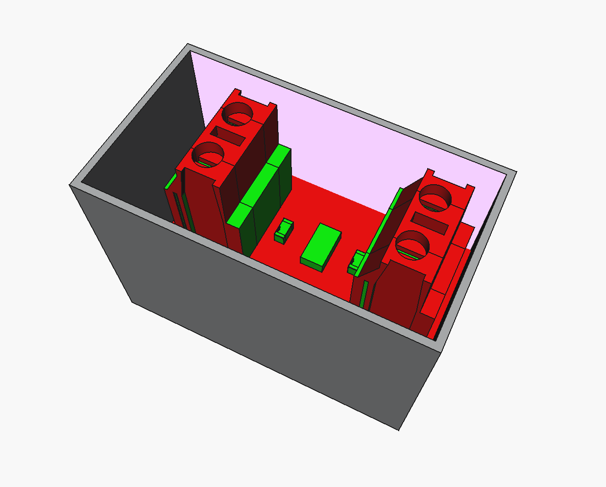

```
████████████████████████████████████████████████████████████████████████████████
██                                                                            ██
██                            Created by YED                                  ██
██                    FreeCAD Clearance Detection (1mm)                       ██
██                            PCB–Enclosure                                   ██
██                                                                            ██
██████████████████████████████ Licensed by YED █████████████████████████████████
```

# FreeCAD PCB–Enclosure Clearance Detection (1 mm)

This repository contains a **FreeCAD Python macro** developed to automatically verify **mechanical clearance between a PCB assembly and its enclosure**.

The macro detects **all PCB or enclosure faces closer than 1.0 mm** (including direct intersections) and highlights them visually inside FreeCAD, eliminating the need for manual measurements.

---

## Purpose

The purpose of this tool is to perform a **reliable, placement-aware clearance check** between ECAD-derived PCB models and MCAD enclosure designs **directly in FreeCAD**, using real-world coordinates.

---

## Example Results

### ✅ No Collision / Clearance OK

When the PCB is correctly placed inside the enclosure and **all clearances are ≥ 1 mm**, the macro highlights:

- PCB in **green**
- Enclosure in **grey**
- **No red faces present**


Clearance check result: **PASSED**

---

### ❌ Collision / Clearance Violation

If **any PCB or enclosure face** is closer than **1.0 mm** (or intersecting):

- The problematic faces are highlighted in **red**
- Clearance is immediately considered **FAILED**



Clearance check result: **FAILED**

---

## Key Features

- Automatic **PCB vs enclosure clearance detection**
- Works in **global (world) coordinates**
- Supports:
  - PCB assemblies with multiple components
  - Enclosures composed of multiple solids (Body, Thickness, Pad001, etc.)
- **Per-face detection** (not only per-object)
- Deterministic **pass / fail result**
- Clear and minimal visual feedback

---

## Visualization Logic

| Object / Condition | Color |
|-------------------|-------|
| PCB (normal) | Green |
| Enclosure (normal) | Grey |
| Clearance < 1 mm or collision | Red |

If **any face is marked red**, the clearance check is considered **FAILED**.

---

## Motivation

Manual clearance checks in FreeCAD are unreliable because:

- Local placements can cause **false distance results**
- Enclosures are often split into multiple solids
- Diagonal or hidden interferences are easily missed

This macro addresses those issues by:

- Rebuilding geometry in **global placement**
- Collecting **all solids** under PCB and enclosure containers
- Performing **face-to-shape minimum distance checks**

---

## Requirements

- FreeCAD (tested on recent stable versions)
- No external Python libraries
- Executed as a standard FreeCAD macro

---

## Expected Object Names

The macro expects the following object names in the FreeCAD document:

- **PCB** → PCB container
- **Body** → Enclosure container
- **Thickness** → Enclosure solid (optional)

If your model uses different names, update the following lines in the script:

```python
pcb_obj   = doc.getObject("PCB")
body_obj  = doc.getObject("Body")
thick_obj = doc.getObject("Thickness")
```

---

## Usage

1. Open a FreeCAD document containing:
   - PCB assembly
   - Enclosure model

2. Open the macro editor:
   - `Macro → Macros… → Create / Edit`

3. Paste the script into a new macro file:
   - `pcb_enclosure_clearance.FCMacro`

4. Run the macro:
   - `Macro → Execute`

The macro executes **once per run**.  
After adjusting PCB placement, simply run it again.

---

## Technical Workflow

1. **Geometry collection**
   - All PCB solids under the PCB container
   - All enclosure solids under the Body container

2. **Placement correction**
   - Shapes are rebuilt using **global placement**
   - Prevents local-coordinate errors

3. **Compound generation**
   - Enclosure solids → single compound
   - PCB solids → single compound

4. **Distance evaluation**
   - For each face:
     - `face.distToShape(other_shape)`
     - Distance `< 1.0 mm` → marked as error

5. **Per-face coloring**
   - Implemented using `ViewObject.DiffuseColor`
   - Stable and visually explicit

6. **Result reporting**
   - Console output
   - Pass / fail message dialog

---

## Configuration

Clearance threshold:

```python
limit_mm = 1.0
```

Color definitions:

```python
pcb_base_color = (0.0, 1.0, 0.0)   # Green
box_base_color = (0.7, 0.7, 0.7)   # Grey
error_color    = (1.0, 0.0, 0.0)   # Red
```

---

## Typical Workflow

- Import PCB STEP (Altium, KiCad, etc.)
- Import enclosure STEP
- Place PCB inside enclosure
- Run macro
- Instantly detect **any clearance < 1 mm**
- Adjust placement and re-run

---

## Limitations

- Does not export numeric clearance values
- Large assemblies may increase runtime
- Requires valid solid geometry

--

## Final Remarks

This macro is intentionally **simple, deterministic, and visual**.

It is designed as a **practical engineering validation tool**, not a demonstration script.

If you see **red**, your mechanical design needs attention.
